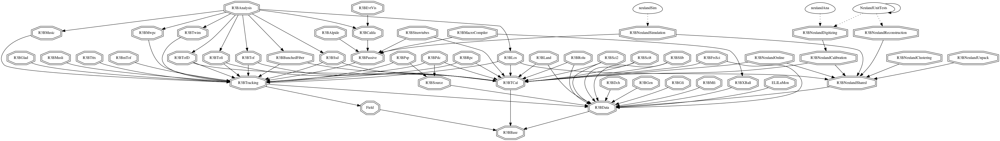

## Quick look

### Dependency graph of R3BRoot



> [!NOTE]
> This dependency graph should be generated and updated by a CI pipeline.

### Adding a library with a ROOT dictionary

```cmake
add_library_with_dictionary(
    LIBNAME # library name for the target
    R3BLibName
    LINKDEF # LinkDef file name for the ROOT dictionary
    LibNameLinkDef.h
    HEADERS # header file names used by the library
    file1.h
    file2.h
    SRCS # source file names used by the library
    file1.cxx
    file2.cxx
    INCLUDEDIRS # include directories of the target
    ${CMAKE_CURRENT_SOURCE_DIR} # the folder of the current CMakeLists.cxx
    dir1 # any sub folders of ${CMAKE_CURRENT_SOURCE_DIR}
    dir2
    DEPENDENCIES # Dependencies
    OtherLib # e.g. R3BSource, R3BTracking
)
```
`PRIVATE` dependencies can be specified by `PRIVATE_INCLUDEDIRS` and `PRIVATE_DEPENDENCIES`.

## Principles of CMake

### What is CMake

CMake is the most popular _build system_ for large C++ projects. Users can specify the build and linking options for C++ binaries using commands defined in `CMakeLists.txt` files.

### CMake targets

The most important conception of "modern" CMake is the so-called CMake **target**. A CMake target can either represent a library or an executable. However, what really makes the CMake target so useful is that a target can attach a library/executable with multiple "target properties", that can be propagated along the dependency chain. See [this list](https://cmake.org/cmake/help/latest/manual/cmake-properties.7.html#properties-on-targets) for all available properties of CMake targets.

#### Creating a simple target

A target can be created either with `add_library` or `add_executable`. The dependencies between different targets can be specified by using `target_link_libraries`:

```cmake
# Creating a library as a target
add_library(mylib SHARED mylib.cxx others.cxx) # Same for add_executable

# Linking the library with other targets/libraries
target_link_libraries(mylib PUBLIC R3BSource PRIVATE R3BNeulandShared)

# add include directory to the target property
target_include_directories(mylib PUBLIC ${CMAKE_CURRENT_SOURCE_DIR} dir1 PRIVATE dir2)
```

`add_library` creates a library or an executable from a list of C++ source files. The header files, such as `mylib.h` and `others.h`, don't need to be added. The keyword `SHARED` tells the target represents a dynamic library. If a static library is needed, use the keyword `STATIC`.

`target_link_libraries` specifies the dependencies of a library. If your library use any classes or functions defined in the library `R3BSource`, you have to add the "R3BSource" either after `PUBLIC` or `PRIVATE` keywords. `target_include_directories` specifies the include directories of a target. The include directories are a set of directory paths that C++ compiler will search when you use a include macro, such as `#include<FileName.h>`. If `FileName.h` doesn't exist in any include directories of the target, the compilation would fail.

The keywords "PUBLIC" and "PRIVATE" specifies whether the properties or dependencies can be propagated in the dependency chain. `PUBLIC` means any libraries (or directories) linked to the current target are also linked to any other targets that link the current target. On the other hand, `PRIVATE` means the dependencies and include directories are only for the current target.

For example, if the following dependency chain exists:

```cmake
target_link_libraries(A PUBLIC B PRIVATE C)
target_link_libraries(D PUBLIC A)
```
the `D` target can use all classes and functions defined in both `A` and `B`, but not in `C`. The functions and classes from `C` can only be used in the target `A`.

Similarly, if the following exists:

```cmake
target_include_directories(A PUBLIC dir1 PRIVATE dir2)
target_include_directories(B PUBLIC dir3)
target_link_libraries(B PUBLIC A)
```
the include directory of the target `B` contains both `dir3` and `dir1`, but not `dir2`.

> [!IMPORTANT]
> It's strongly recommended that `PRIVATE` should always prioritized above `PUBLIC` to reduce unnecessary dependencies. Clean dependencies can improve the compile time of the project.

#### Behind `add_library_with_dictionary`

From this ROOT official [webpage](https://root.cern/manual/io_custom_classes/#using-cmake), it can be found that a root dictionary can be generated directly from a target:

```cmake
ROOT_GENERATE_DICTIONARY(myapp_dict myapp.h MODULE myapp LINKDEF LinkDef.h)
```

Thus, the implementation of the CMake function `add_library_with_dictionary` utilize such the feature and create a target together with a root dictionary:

```cmake
add_library(${LIBNAME} SHARED ${SRCS})
target_include_directories(
    ${LIBNAME}
    PUBLIC ${INCLUDEDIRS}
    PRIVATE ${PRIVATE_INCLUDEDIRS})
target_link_libraries(
    ${LIBNAME}
    PUBLIC ${DEPENDENCIES}
    PRIVATE ${PRIVATE_DEPENDENCIES})
root_generate_dictionary(${LIBNAME}_dict ${HEADERS} MODULE ${LIBNAME} LINKDEF
                         ${LINKDEF})
```

NOTE: for the full detail of the CMake function, please visit the [source file](../cmake/utils/create_library_with_dictionary.cmake).
