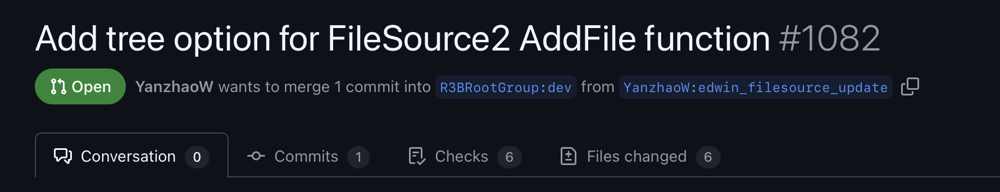
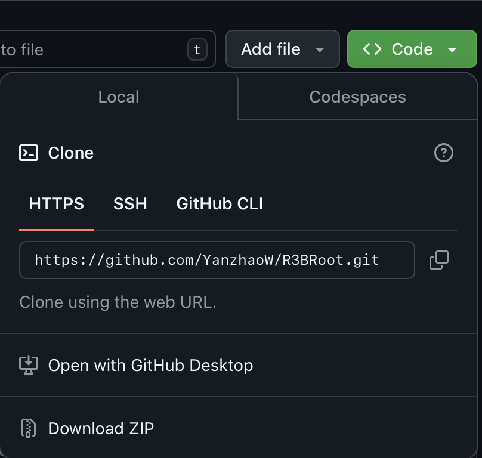

## Fetch the update from an unmerged pull request (PR)

More often than not, people need to use new features from a pull request that is not yet merged to the dev branch. In this case, the new features can still be added to your local repository with following steps:

### Step 1: Identify the remote and branch name

Go to the [R3BRoot pull request](https://github.com/R3BRootGroup/R3BRoot/pulls) webpage and find the pull request that has the new features you need. For example:



In the example above, you could see the pull request is made from `YanzhaoW:edwin_filesource_update`. Here the user who made the PR has the account name "YanzhaoW". The branch, which is used to create the PR, is called "edwin_filesource_update". His remote repository can be checked by clicking this `YanzhaoW:edwin_filesource_update` and you will be redirected to the webpage of his remote repository. As for the example above, the remote url can be check by clicking the green button and choose the `HTTPS` tab:



In this case, the remote url is `https://github.com/YanzhaoW/R3BRoot.git`.

### Step 2: Add the remote

First, go to your local repository and check all your existing avaliable remote urls:

```bash
git remote -v
```

the output could be:

```text
origin  git@github.com:YanzhaoW/R3BRoot.git (fetch)
origin  git@github.com:YanzhaoW/R3BRoot.git (push)
pulrich git@github.com:P-Ulrich/R3BRoot_Fork.git (fetch)
pulrich git@github.com:P-Ulrich/R3BRoot_Fork.git (push)
slonzen https://github.com/SimonL2718/R3BRoot.git (fetch)
slonzen https://github.com/SimonL2718/R3BRoot.git (push)
upstream        https://github.com/R3BRootGroup/R3BRoot.git (fetch)
upstream        https://github.com/R3BRootGroup/R3BRoot.git (push)

```

Here each remote url is attached to an unique name, called "remote name". One special url, namely `https://github.com/R3BRootGroup/R3BRoot.git`, represents the git repository of R3BRoot, which everyone pushes the updates to. Thus, when you need to update your dev branch, please use the remote name corresponding to this remote url. In the case above, the remote name is "upstream".

If the remote url from the step 1 already exists, go to step 3. If you can't find the remote url from the step 1, please add it with:

```bash
git remote add [remote name] [remote url]
```

For example

```bash
git remote add yanzhao https://github.com/YanzhaoW/R3BRoot.git
```

You can use a different remote name for the new remote url. But please make sure it's different from all existing remote names. Once this is done, check the remotes again with `git remote -v` to make sure the new remote is added correclty.

### Step 3: Update the dev branch

Once the new remote name is added, first make sure you are in a clean git status:

```bash
git status
```

you should expect an message with "nothing to commit, working tree clean". If not, either commit the changes or reset to last commit (ATTENTION: if you use reset, all the uncommitted changes would be lost):

```bash
git reset --hard HEAD
```

After git status is clean, switch to dev branch and update it from the upstream

```bash
git checkout dev
git pull --rebase upstream dev
```

Here the name "upstream" is the remote name that points to the remote url `https://github.com/R3BRootGroup/R3BRoot`. Change "upstream" to the corresponding name if you have a different situation.

### Step 4: Fetch the update from the remote

After dev branch is updated, now you need to fetch the update from the pull request.

```bash
git fetch [remote name] [branch name]
```

Here the `[remote name]` is the name you used/found in step 2 and `[branch name]` is the branch name you identified in step 1.

### Step 5: Checkout

After the update is fetched, check the new branch with:

```bash
git checkout [banch name]
```

Here, again, `[branch name]` is the branch name you identified in step 1.

### Step 6: Recompile the program

Recompile the program with:

```bash
cmake --build ./build -- -j${number_of_threads}
source build/config.sh
```

### How to apply the changes on a new branch

First, make sure you are in the branch that contains the changes and git status is clean. Then to apply your changes on another branch, use:

```bash
git rebase [another branch]
```

It's likely that you encounter some "conflicts" that must be resolved before moving forward. If this happens, please refer to [Resolving merge conflicts after a Git rebase](https://docs.github.com/en/get-started/using-git/resolving-merge-conflicts-after-a-git-rebase) for the instruction.

### How to pull the latest version of the pull request branch

To pull the latest version, use

```bash
git pull --rebase [remote name] [branch name]
```

Note that this may fail if the person who made the PR `force push`ed the update to his remote. In such case, first go to the dev branch and delete the remote branch:

```bash
git checkout dev
git branch -D remote_branch_name
```

then start it over from step 4.

## How to make your local git repository in a clean state

Whenever you need to pull the updates from the dev branch or other people's branch, your git repository must be in a **clean state**:

```bash
git status
```

if your state is clean, you should get a message "nothing to commit, working tree clean". If not, use one of the following methods.

### Method 1: commit to your own branch

#### step 1: Create new branch if necessary

First make sure you are not in the dev or master branch (which can be checked by `git branch`). If so, create a new branch for your changes:

```bash
git checkout -b [branch name]
```
Here `[branch name]` is can any name. Once on the new branch, commit all the changes to the new branch:

```bash
git add -A
git commit -m "any message you want to write for the branch"
```

After this is done, go back to the dev branch:

```bash
git checkout dev
```

### Method 2: Reset back to the latest commit

If you don't need any uncommitted changes, you could reset it back to the latest head of the current branch:

```bash
git reset --hard HEAD
```
Be aware that this will erase any uncommitted change permanently.

### Method 3: Stash the change

You could first put all the changes into a temporary stash with

```bash
git stash
```

After you completed all the actions, to get your changes back:

```bash
git stash pop
```
